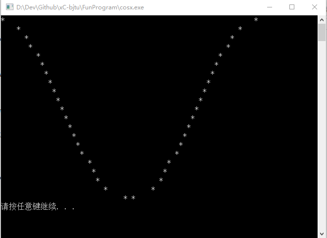

# xC-bjtu
C or C++ program I have wrote in my college(BJTU)

### 八皇后问题
`wikipedia定义`  
> 八皇后问题是一个以国际象棋为背景的问题：
如何能够在8×8的国际象棋棋盘上放置八个皇后，使得任何一个皇后都无法直接吃掉其他的皇后？
为了达到此目的，任两个皇后都不能处于同一条横行、纵行或斜线上。

### FunProgram
趣味程序集
- `cosX`函数绘制，使用`*`绘制   

### 冒泡排序
- `BubbleSort`，下面是不用其余变量交换数值的方法

### 选择排序
- `selectSort`选择排序，每次查找未排序部分的最小值，将其与未排序部分第一个元素互换，使得已排序部分加长，如此这般，最终完成排序

### 折半查找
- `binaryFind`折半查找，要求所查找的数据是有序的，关键在更新high/low的值

### 顺序查找
- `seqenceFind`顺序查找，从后往前查，array[0]保留key
